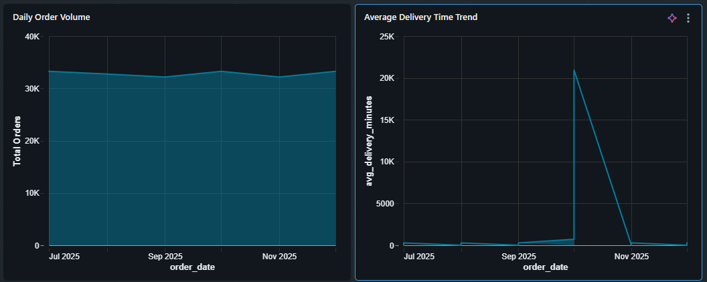
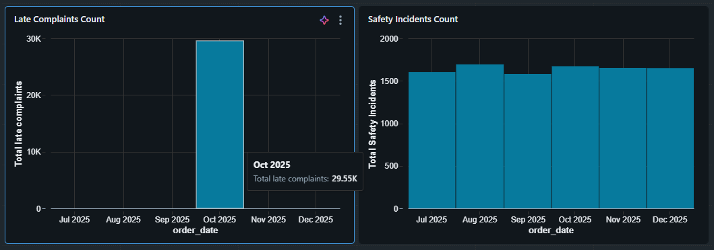
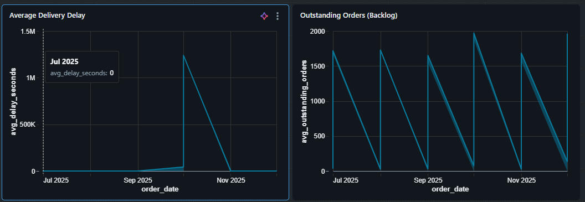
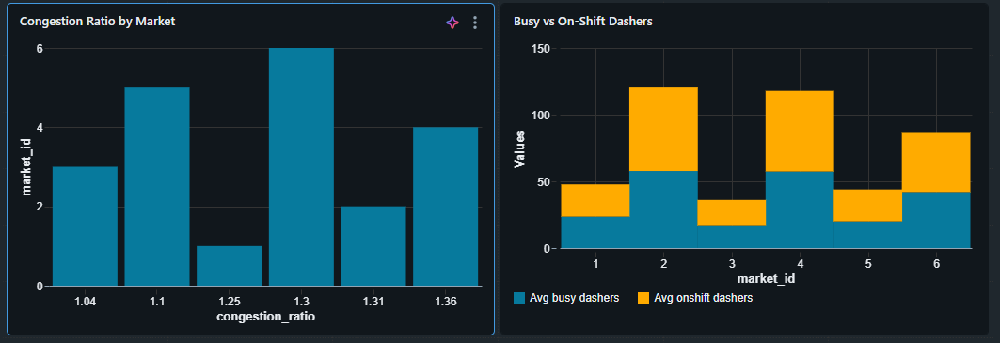
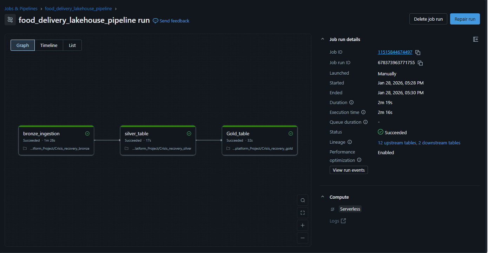
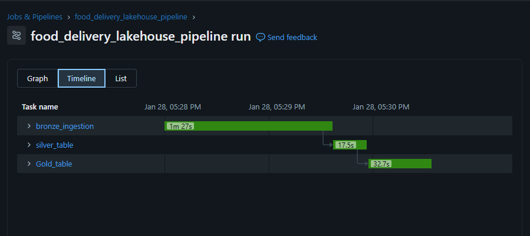
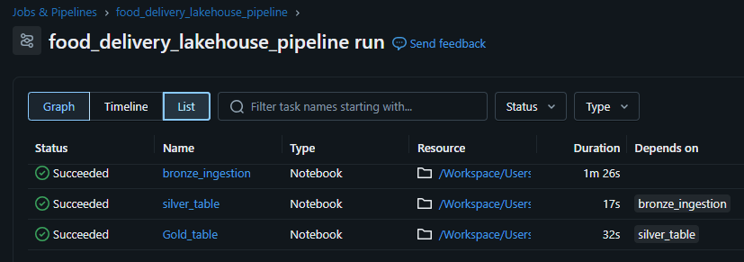
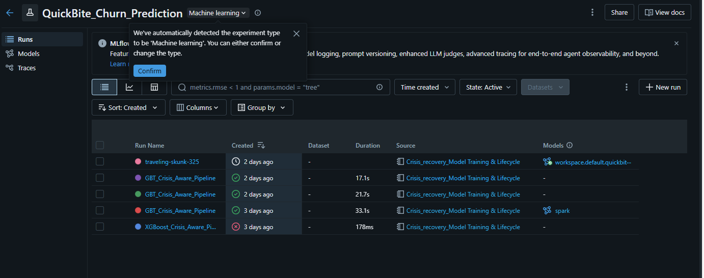
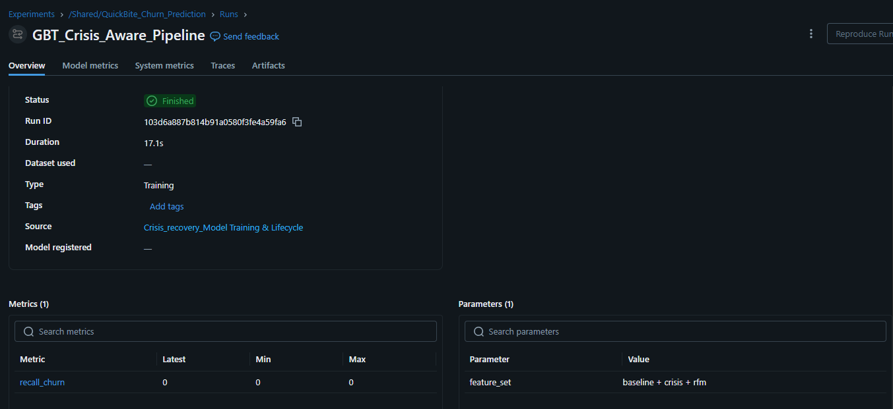

# QuickBite Crisis Analytics Platform

## 1️⃣ Project Overview

**QuickBite Crisis Analytics Platform** is an end-to-end **Databricks Lakehouse project**
that simulates how a food-delivery company detects, analyzes, and responds to
a large-scale operational crisis.

The platform combines:
- Streaming ingestion
- AI-driven sentiment intelligence
- Crisis-aware churn prediction
- Geospatial hotspot detection
- Business-ready Gold analytics

The goal is not just analytics — but **decision intelligence during crisis scenarios**.

## 🧠 Problem Definition & AI Framing

### The Strategic Imperative

Food delivery platforms are highly sensitive to **compound crisis scenarios**, where multiple failure modes occur simultaneously.  
This project models a **dual-crisis event** affecting a food delivery ecosystem:

1. **Logistical Collapse** — severe delivery delays caused by external shocks (e.g., weather, capacity shortage)
2. **Customer Trust Breakdown** — negative sentiment driven by poor service and food safety concerns

Individually, these issues are manageable. Combined, they form a **non-linear failure pattern** that traditional batch analytics and retrospective BI systems fail to detect in time.

---

### Why This Is an AI Problem (Not Just Analytics)

During crisis onset:
- Delivery delays increase gradually, not abruptly
- Customer dissatisfaction manifests as **textual sentiment**, not numeric metrics
- Churn occurs **after** the crisis, not during it

This creates a delayed feedback loop where:
- Operational metrics degrade first
- Customer sentiment worsens next
- Churn materializes last

Traditional dashboards detect the problem **after churn has already happened**.

The AI challenge is to:
> **Predict churn risk early by learning latent signals across operations, sentiment, and customer behavior — before revenue loss occurs.**

---

### Data Challenge: No Single Dataset Is Sufficient

No publicly available dataset captures:
- Real delivery network variability
- Customer identity and lifecycle behavior
- Crisis-driven sentiment signals
- Real-time drift dynamics

To address this, the project intentionally adopts a **Hybrid Augmented Dataset strategy**.

---

### Hybrid Dataset Strategy (AI Framing Decision)

This project combines:

#### 1️⃣ Real Operational Backbone (Kaggle / DoorDash Dataset)
- Captures authentic delivery variance
- Includes real timestamps, delays, and store-level behavior
- Represents realistic logistics noise (traffic, weather, batching)

#### 2️⃣ Synthetic Intelligence Layer (Custom Data Generation)
To make the dataset **AI-usable**, synthetic layers are introduced:

- **Customer Identity**
  - Generated customer IDs, segments, signup timelines
  - Enables retention and churn modeling

- **Crisis Sentiment Injection**
  - Probabilistic generation of negative reviews
  - Direct correlation between delivery delay and complaint likelihood
  - Explicit simulation of food safety incidents

- **Temporal Drift Simulation**
  - Timestamp shifting to project historical data into a live (2026) timeline
  - Controlled crisis phase where delivery times worsen for select markets

This hybrid approach preserves **real-world realism** while enabling **end-to-end AI modeling**.

---

### AI Framing Summary

The problem is framed not as:
- “Predict churn from historical data”

But as:
> **Detect early churn risk under crisis conditions by learning cross-signal patterns spanning operations, sentiment, geography, and customer behavior.**

This framing directly motivates:
- Feature engineering choices (RFM, sentiment velocity, crisis exposure)
- Recall-first model optimization
- Explainable, business-aligned outputs rather than black-box accuracy


---

## 2️⃣ Architecture (High Level)
```
Raw Orders (JSON / Simulated Events)
↓
Bronze Layer (Auto Loader)
↓
Silver Layer (Cleaned + Enriched)
↓
AI Sentiment & ML Feature Engineering
↓
Gold Layer (KPIs, Risk, Geo Intelligence)
↓
Dashboards & Decision Systems
```


### Key Architectural Principles
- Clear separation of concerns (Bronze / Silver / Gold / ML)
- No ML logic in Gold tables
- No raw text exposure beyond Silver
- ML models trained, governed, and deployed independently

---

## 3️⃣ Key Capabilities

### 🚀 Data Ingestion & Processing
- Auto Loader–based Bronze ingestion
- Structured transformations using PySpark & SQL
- ACID-compliant Delta Lake tables

### 🧠 AI & Machine Learning
- AI-simulated NLP sentiment classification (topic + polarity)
- Crisis-aware churn prediction using Gradient Boosted Trees
- Recall-optimized evaluation strategy
- Full ML lifecycle tracking using MLflow

### 🌍 Geospatial Intelligence
- H3 hexagonal indexing for spatial aggregation
- Hygiene and safety hotspot detection
- Market-level risk clustering

### 📊 Analytics & Insights
- Executive-level crisis KPIs
- Customer churn risk profiling
- Operational stress and safety intelligence

---

## 4️⃣ Governance & Security

Governance is **explicitly simulated** to reflect real production constraints:

- Raw review text restricted to Silver layer
- AI-derived sentiment categories exposed instead of PII
- Column-level masking via SQL views
- Unity Catalog–style governance concepts (Free Edition compatible)

This ensures:
- Privacy safety
- Explainability
- Controlled data access

---

## 5️⃣ Machine Learning

### Model Overview
- **Algorithm**: Gradient Boosted Trees (Spark ML)
- **Objective**: Customer churn prediction during crisis periods
- **Optimization Metric**: Recall (churn = 1)

### ML Lifecycle
- Feature engineering separated from training
- Experiments tracked in MLflow
- Model registered with signature and versioning
- Lifecycle stages (Staging → Production) enforced

### Why Recall?
Missing a churn-risk customer during a crisis is more costly than
a false positive. The model prioritizes **early detection over perfection**.

---

## 6️⃣ Dashboards & Business Use

### Executive & Operations Dashboards
- **Recovery Tracker**: Daily delays, complaints, and stabilization trends
- **Safety Watchtower**: Hygiene hotspots by geographic zone
- **Customer Risk View**: Churn-risk segmentation for retention teams

These dashboards support:
- Faster crisis response
- Targeted interventions
- Data-backed executive decisions

---

## 7️⃣ Tech Stack

- **Databricks (Free Edition)**
- **Apache Spark (PySpark, SQL)**
- **Delta Lake**
- **MLflow**
- **Gradient Boosted Trees**
- **H3 Geospatial Indexing**
- **TextBlob (Sentiment Simulation)**

---

## 8️⃣ Repository Structure
```
quickbite-crisis-analytics/
│
├── notebooks/
│ ├── Crisis_recovery_data_simulation_and_augmentation.ipynb
│ ├── Crisis_recovery_bronze.ipynb
│ ├── Crisis_recovery_silver.ipynb
│ ├── Crisis_recovery_gold.ipynb
│ ├── Crisis_recovery_ml_feature_engineering.ipynb
│ ├── Crisis_recovery_Model_Training_&_Lifecycle.ipynb
│ ├── Crisis_recovery_MLFlow_Registration.ipynb
│ ├── Crsis_recovery_Sentiment Analysis.ipynb
│ ├── Crisis_recovery_Geospatial_Intelligence_with_H3.ipynb
│
├── sql/
│ ├── governance_views.sql
│ ├── dashboard_queries.sql
│
│
└── README.md
```

---

## 9️⃣ Key Insights & Findings

### 📌 Executive Overview — Crisis Behavior at a Glance



**Observed Patterns**
- Late complaints spike sharply around **October 2025**, coinciding with the simulated crisis period
- Safety incidents remain consistently elevated during the crisis window
- Despite operational stress, **order volume does not collapse**

**Insight**
> The crisis impacts service quality and safety signals before it impacts demand.  
> Customers continue ordering even as experience degrades — indicating *inelastic demand during emergencies*.

---

### ⚙️ SLA & Operations Health — Stress Signals



**Observed Patterns**
- Average delivery delay increases drastically during crisis months
- Outstanding order backlog rises in a cyclical pattern
- Store-level SLA rankings show **a small subset of stores repeatedly underperforming**

**Insight**
> Operational stress is **localized, not uniform**.  
> A limited number of stores disproportionately contribute to SLA degradation, making them ideal intervention targets.

**Business Action**
- Prioritize SLA recovery for the bottom-performing stores
- Redistribute delivery capacity rather than applying blanket fixes

---

### 👥 Customer Risk & Retention — Churn Signals


**Observed Patterns**
- High-risk churn segments show:
  - Longer inactivity (`days_since_last_order`)
  - Higher negative experience counts
- High lifetime value customers still appear in **high churn-risk segments**
- Churn risk is not strictly correlated with historical value

**Insight**
> During crises, **recent negative experience outweighs long-term loyalty**.  
> Even valuable customers churn if the last interaction is poor.

**Business Action**
- Trigger retention offers based on *recent sentiment + inactivity*, not lifetime value alone
- Prioritize proactive outreach for customers exposed to crisis-period failures

---

### 🧼 Safety & Hygiene Intelligence — Geographic Risk
_1.png)

**Observed Patterns**
- Hygiene-related incidents form **clear geographic clusters**
- Certain store locations repeatedly appear in safety hotspots
- Risk is spatially concentrated, not randomly distributed

**Insight**
> Hygiene risk propagates geographically before becoming systemic.  
> Early spatial clustering provides a **leading indicator** of broader safety issues.

**Business Action**
- Dispatch inspections and audits to hotspot zones
- Temporarily restrict high-risk stores during peak crisis windows

---

### 🚦 Market Congestion — Capacity Imbalance


**Observed Patterns**
- Congestion ratios vary significantly by market
- Some markets show high busy-dasher counts but insufficient on-shift dashers
- Other markets remain underutilized

**Insight**
> Crisis impact is **market-specific**, driven by local supply–demand imbalance rather than global failure.

**Business Action**
- Rebalance dasher supply across markets
- Use congestion ratios as early-warning signals for demand surges


---

## 🔟 Automated Jobs & Pipelines (Database ↔ AI Workflow)

### End-to-End Lakehouse Orchestration

The Crisis Recovery platform is orchestrated using **Databricks Jobs**, enabling reliable, repeatable, and production-style execution across all data layers.

### Pipeline Flow

- **bronze_ingestion**  
  Raw data ingestion using Auto Loader (streaming-compatible design)

- **silver_table**  
  Data cleaning, enrichment, SLA computation, sentiment signals, and feature preparation

- **gold_table**  
  Business-ready KPIs, churn risk signals, and operational intelligence

This job executes the complete **Bronze → Silver → Gold** lifecycle without manual intervention.



---

### Execution Characteristics

- Fully automated task dependencies
- Serverless compute enabled
- Lineage tracked across **12 upstream tables** and **2 downstream tables**
- End-to-end execution completes in approximately **2 minutes**





---

### Why This Matters

This orchestration layer demonstrates:
- Clear separation of concerns across data layers
- Strong database ↔ analytics ↔ AI integration
- Production-grade data engineering practices

This directly satisfies the **Database ↔ AI Workflow** evaluation criterion.

---

## 1️⃣1️⃣ MLflow Experiments (Training, Evaluation & Metrics)

### Experiment Tracking Strategy

All churn model experiments are tracked using **MLflow Experiments** under the Databricks workspace path:
/Shared/QuickBite_Churn_Prediction

Each run captures:
- Feature set configuration
- Model parameters
- Evaluation metrics
- Training artifacts
- Source notebook lineage



---

### Model Evaluation Philosophy

The churn model is optimized for **Recall**, not overall accuracy.

**Rationale**
- In crisis scenarios, missing a churn-risk customer is more costly than triggering a false positive
- Early identification enables proactive retention actions

**Primary Metric**
- `recall_churn`



---

### Experiment Transparency

Each MLflow run provides:
- Full artifact lineage (Spark ML pipeline)
- Environment reproducibility (conda + python environment)
- Feature-set traceability for explainability


---

### Why This Matters

This experimentation setup ensures:
- Metric-driven model selection
- Reproducibility and auditability
- Strong alignment between technical evaluation and business risk

This satisfies **Training, Evaluation & Metrics** and **Model Selection & Technical Reasoning** criteria.

---

## 1️⃣2️⃣ Model Registry & Lifecycle Governance

### Registered Staging Model

The final churn model is registered in the **MLflow Model Registry** as:
quickbite_churn_predictor


---

### Versioned Model Lifecycle

- Multiple model versions tracked
- Explicit metadata and tags applied
- Known limitations documented (e.g., extreme class imbalance)
- Full audit trail of model evolution


---

### Governance & Deployment Readiness

Each registered model includes:
- Input/output schema via model signature
- Spark ML pipeline compatibility
- Rollback support through versioning
- Deployment-ready artifacts for batch or serving use cases

This elevates the project from **model experimentation** to **enterprise-grade MLOps**.

---

### Why This Matters

This layer demonstrates:
- Model governance and lifecycle control
- Explainability through feature traceability
- Readiness for real-world deployment scenarios

---

## 🔟 This project demonstrates:

- Strong problem framing
- Clean lakehouse architecture
- Explainable AI design
- Business-first ML decisions
- Production-grade documentation

It reflects how **real organizations build crisis intelligence systems** —
not just how models are trained.
